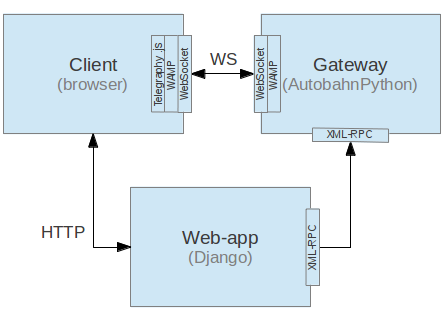

=======================
The Telegraphy Project
=======================

This project is about making the *real-time web* easier for the Django developers (and to Python web-developers in general).

In a very general way, the issue we want to solve is **How can I easily receive and handle server-side generated events, on the frontend?**.

There's a lot going on about this. There are many standards, protocols, tools, services and sophisticated frameworks related to this issue.
But most of them have at least one of the following problems:

    - They don't solve the whole problem
    - They are not easy to use.
    - They are not well documented.

Therefore, our main objectives are to provide:
    - well documented and tested tools,
    - that are simple to install and use,
    - which rely on open standards and protocols,
    - to emmit and handle asynchronous, server-side events in real-time.

Components
**********

The Telegraphy project's architecture has three main components:
 * A web-application that registers and emits events. The current project includes a very powerful `Django app`_.
 * A Gateway_ is an scalable, high-performance, asynchronous, networking engine.
 * A `client api`_ which talks `WAMP <http://wamp.ws//>`_ (through a WebSocket) with a *Gateway*.
   This is normally a JavaScript loaded from a web-page. An API is provided, based on `AutobahnJS <http://autobahn.ws/js>`_.

.. _gateway:

Gateway
********

The gateway has the responsability to assure continuous service. Changes in configuration or events definitions must be transparent for the client (if possible). Otehrwise, specific resources muts be design in order to be able to implement client-side mechanisms to remain "connected" (reconnect, etc).

Client representatives identification: on connection, the Gateway provides a unique identifier (token). The representatives saves the token in a cookie. The cookie has an expiration time defined by the Gateway.

Persitent subscriptions: a client may decide that a given subscription to an event is 'permanent'. The subscription mechanism provided by the protocol must include some parameter to indicate this situation.

    - Real Time Events
        - Authentication
        - Subscription handling
            - Public vs Authnticated Events
            - Subscription management (client or event based)
        - Persistant Subscriptions
        - Event management
            - Class based event definition
            - Event query language
                - Performance
                - Simplified client side subscription handling
                - Easy channel emulation

.. _Django app:

Django Telegraphy
*****************
    - Management command for server (run with minimal settings)
    - Automatic model based CUD events (Create, Update, Delete)
    - Custom Event definitions
    - Template tags for easy configuration

This module allows to define events by inheriting from a base telegraphy.Event class.
Different specialized type of events are provided: guaranteed delivery, with TTL, etc.

.. _client api:

JavaScript API
****************
Luego desde el JS uno puede 'suscribirse' y/o consultar los tipos de eventos disponibles.
Desde el cliente, se pide suscribir a 'pepitos' y el Gateway sabrá si el evento 'pepito' exite o no.

The JS API provides a Gateway 'representative' which is responsible of:
 * connect to a running instance of a Gateway
 * subscribe to events. Free events? can we subscribe to unregistered Gateway events?
 * provide means to handle connection changes (keep the connection alive?)
 * Implelements the custom, websockets-based protocol
 *

Django app
************
El emisor define

Django authentication
***********************

Authentication shortcomings
===========================

Django uses a **HTTP Only** cookie called *sessionid*. This cookie would not be exposed to JavaScript for
security issues. Since Gateway process may not run in the same context (port, ip, machine) where Django is running, we can't
rely on it for authentication.

In order to authenticate clients we must pre share a secret *ws auth token*.
This token is created by the gateway whenever a page that uses telegraphy template tag is rendered.
These tokens are short lived, they expire once the websocket connection has been established.

If the client reconnects it must send a CONNECT command

